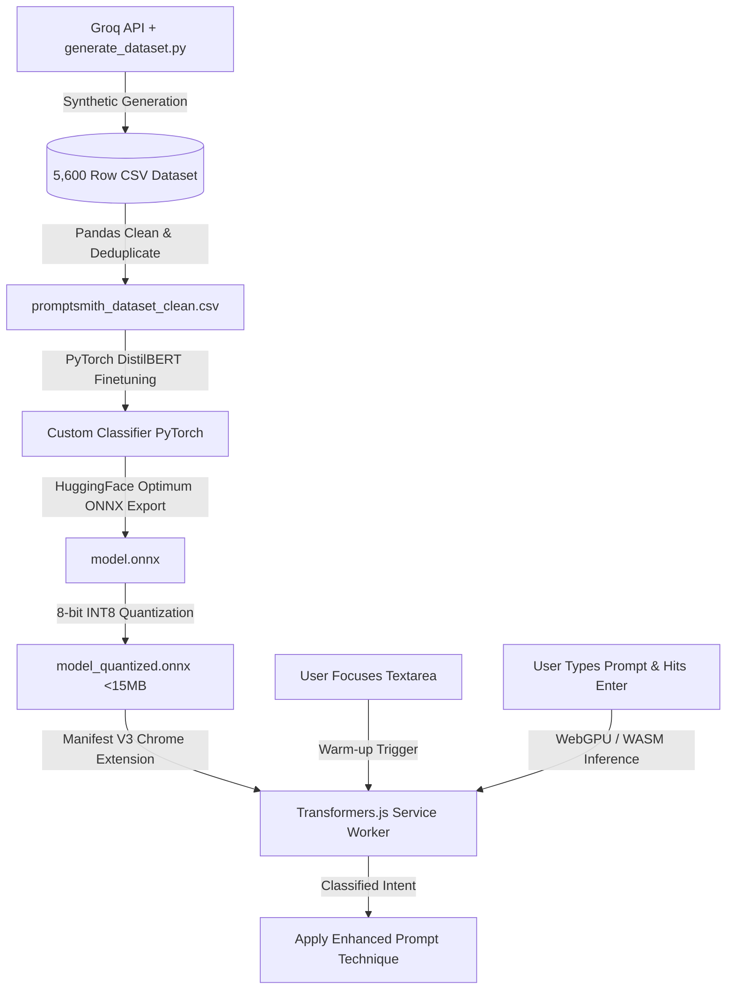

# PromptSmith 🛠️✨

[](LICENSE)
[](#)
[](#)
[](.github/CONTRIBUTING.md)

**PromptSmith** is a technique-aware, premium, zero-cost Chrome Extension designed to instantly enhance your LLM prompts inside **ChatGPT, Claude, and Gemini**. 

It runs an ultra-fast, in-browser classification scanner that automatically determines the intent of your prompt (e.g. math, code, planning, factual, analysis, creative) and enhances it in real-time using academically proven prompting techniques—all with zero latency and offline support. When local rules need a boost, it cascades to generous free-tier APIs (Groq, Google AI Studio, OpenRouter) to write state-of-the-art prompt extensions.

---

## 🚀 Key Features

- **⚡ Zero-Cost local classification:** Instantly analyzes prompt intent in-browser using regex rules.
- **🔗 8 Modular prompting strategies:** Seamlessly applies CoT, Program-of-Thought, Least-to-Most, Step-Back Abstraction, and more.
- **⚡ Smart "Reasoning Model" detection:** Automatically recognizes if you're on a thinking model (like OpenAI o1/o3, DeepSeek R1, or Claude with Thinking) and shifts from heavy structural additions to lightweight cognitive context to save tokens and prevent conflicts.
- **🤖 Cascade Free-API Fallback:** Securely coordinates with Groq, Gemini AI Studio, or OpenRouter for deep AI rewriting, falling back to local formulas offline.
- **🎭 Glassmorphic Interactive Dashboard:** Offers manual overrides to experiment with different techniques in one click, along with token-multiplying estimates and instant "Undo".
- **🔒 Privacy-Focused:** No central servers. All API keys are stored securely in `chrome.storage.sync` and are never shared.

---

## 🛠️ Installation & Setup

### 1. Load Unpacked in Chrome
1. Clone this repository to your local machine:
   ```bash
   git clone https://github.com/promptsmith/promptsmith.git
   cd promptsmith
   ```
2. Open Chrome and navigate to `chrome://extensions/`.
3. Enable **Developer mode** (toggle in the top-right corner).
4. Click **Load unpacked** in the top-left and select the `extension` folder inside the project.

### 2. Enter Free API Keys (Optional but Recommended)
Click the **PromptSmith** extension icon in your toolbar to configure settings:
- **Groq API Key:** console.groq.com (~14,400 free req/day)
- **Google AI Studio Key:** aistudio.google.com (~1,500 free req/day)
- **OpenRouter Key:** openrouter.ai (Free credits / endpoints)

*Choose "Auto-Route" to automatically fall back in order of speed and tier limits!*

---

## 📖 Supported Techniques & Papers

For full mathematical descriptions and examples, see our [Techniques Wiki](docs/techniques.md).

- **Chain-of-Thought (CoT)** - *Wei et al. 2022* (Best for Math & Logic)
- **Program-of-Thought (PoT)** - *Chen et al. 2022* (Best for Coding & Calculations)
- **Least-to-Most** - *Zhou et al. 2022* (Best for Roadmaps & Planning)
- **Step-Back Abstraction** - *Zheng et al. 2023* (Best for Concepts & Factual queries)
- **Structured Persona** - *Reynolds & McDonell 2021* (Best for Creative drafting)
- **Self-Refinement** - *Madaan et al. 2023* (Best for Auditing & Code reviews)
- **Skeleton-of-Thought** - *Ning et al. 2023* (Best for Long-form reports)
- **Few-Shot Prompting** - *Brown et al. 2020* (Best for structured tone mapping)

---

## 🧠 V2 Edge ML Architecture & Local Training Pipeline

While V1 uses high-performance regex scanners for zero-latency categorization, **PromptSmith V2** upgrades this engine to a full **Edge Machine Learning Pipeline** running a quantized NLP classification model directly inside your browser's Manifest V3 background service worker via **Transformers.js** and **WebGPU**.



### 1. High-Quality Synthetic Dataset Generation
To train our classifier, we engineered an advanced, resilient synthetic data pipeline in [generate_dataset.py](generate_dataset.py). 
* **Target Scale:** 5,600 premium classification rows (8 intents $\times$ 700 diverse samples per category).
* **API Resiliency:** Integrates Groq SDK (`llama-3.1-8b-instant`) with automatic **Resume Mode** (preserves existing rows on restart), immediate standard output flushing, and **exponential rate-limit cooling windows** (45s/60s/90s backoffs) to operate successfully on free-tier quotas.
* **Aesthetic Diversity:** Instructs the LLM to generate prompts featuring casual typos, indian-english syntax ("kindly do..."), command structures, and complex multiline requests.

### 2. Fine-Tuning & Quantization Pipeline
1. **Model Backbone:** `distilbert-base-uncased` (chosen for optimal size-to-accuracy ratio).
2. **Training Context:** Fine-tuned on our cleaned CSV dataset via a free Google Colab Tesla T4 GPU.
3. **ONNX Compilation:** Exported using Hugging Face Optimum:
   ```bash
   optimum-cli export onnx --model distilbert-classifier model_onnx/
   ```
4. **8-bit Integer Quantization (INT8):** Compresses the model weights from ~268MB down to **under 15MB**, enabling rapid download and caching within the user's browser without bloat:
   ```python
   from onnxruntime.quantization import quantize_dynamic, QuantType
   quantize_dynamic("model.onnx", "model_quant.onnx", weight_type=QuantType.QUInt8)
   ```

### 3. In-Browser WebGPU/WASM Manifest V3 Execution
* **Transformers.js Integration:** The background service worker imports `model_quant.onnx` using the ES modules layout.
* **Hardware Acceleration:** Runs inference using **WebGPU** (falling back to WASM / CPU if WebGPU is disabled), executing categorization in under **15 milliseconds**!
* **Pre-Warm Focus Triggers:** To ensure zero input latency, the extension's content script detects when a user clicks/focuses a prompt textbox inside ChatGPT/Claude/Gemini, sending an asynchronous message to **pre-warm the service worker and load the ONNX model into memory** before the user finishes writing!

---

## 💻 Local Development

### Prerequisites
- Node.js (v18+)
- npm

### Setup & Compilation
Install dev packages (Jest, ESLint, esbuild) and compile the project bundles:
```bash
# Install dependencies
npm install

# Run static analysis / lint check
npm run lint

# Run Jest unit test suite
npm run test

# Bundle code for Extension load
npm run build

# Watch mode for real-time CSS/JS changes
npm run watch
```

---

---

## 🚀 Publishing to Chrome Web Store

Follow these steps to submit PromptSmith to the Chrome Web Store:

### Step 1: Compile Zip Archive
Zip the unpacked `extension` folder, strictly **excluding** the heavy `models/` directory and any development `node_modules/` to ensure a minimal, fast-downloading footprint (~150KB core).
*(Users will download the quantized ONNX models directly into their local folder as a one-time post-installation step).*

### Step 2: Create a Developer Account
1. Navigate to the [Chrome Developer Console](https://chrome.google.com/webstore/devconsole).
2. Register an account with a one-time $5 registration fee.

### Step 3: Prepare Storefront & Marketing Assets
Ensure the following materials are uploaded to your listing:
*   **Screenshots:** At least one 1280x800 image (max 5) showing active prompt enhancements. We have generated a modern storefront template located at [store-assets/screenshot-template.png](file:///d:/projects/prompt-smith/store-assets/screenshot-template.png).
*   **Promotional Tile:** A 440x280 promotional tile. We have generated a premium glassmorphic title card at [store-assets/promotional-tile-template.png](file:///d:/projects/prompt-smith/store-assets/promotional-tile-template.png).
*   **Short Description:** Max 132 characters. Pre-compiled in [store-assets/short-description.txt](file:///d:/projects/prompt-smith/store-assets/short-description.txt): *"Optimize LLM inputs instantly. Auto-classifies and enhances your AI prompts locally using offline ONNX transformer models."*
*   **Detailed Description:** Provide functional instructions explaining edge inference, WebGPU acceleration, and step-by-step model download instructions (matching the Onboarding Wizard).
*   **Privacy Policy:** Publish the URL to the repository's [PRIVACY_POLICY.md](file:///d:/projects/prompt-smith/PRIVACY_POLICY.md) (mandatory even for free extensions).

---

## 🤝 Contributing

PromptSmith is highly modular and open-source friendly. Want to add a new prompting technique like Reflexion? Review our [Technique Expansion Guide](docs/adding-techniques.md) to build and wire it up in 5 minutes!

---

## 📄 License

MIT Licensed. See [LICENSE](LICENSE) for details.
