# PromptRoute ⚡

<p align="center">
  
  
  
  
  
</p>

---

## ⚡ The Ultimate Dynamic Prompt Enhancer

> **PromptRoute** is the only browser extension that dynamically analyzes your prompt and applies the **exact** prompting technique required for the task. Rather than using generic templates, it routes your inputs to optimal reasoning patterns (such as Chain-of-Thought, ReAct, and Least-to-Most) using an **offline, local DistilBERT classifier** running in your browser.

---

## 🧠 Why PromptRoute?

Standard prompt tools wrap every input in a generic template:
`Role` ➔ `Task` ➔ `Constraints` ➔ `Output Format`. 

**PromptRoute is different:**
*   🌐 **Intelligent Intent Categorization:** Instantly detects the category of your request (Coding, Planning, Mathematical, Factual, Creative, etc.).
*   ⚡ **Dynamic Cognitive Routing:** Selects and injects the optimal prompting paradigm backed by major AI research papers.
*   🔮 **Completely Transparent:** Explains exactly **why** the specific technique was chosen, displaying the token multiplier, AI rationale, and research citation.
*   ⚡ **Token-Efficient Compression:** Prunes filler words ("please", "make sure to") if Token-Efficient mode is enabled, keeping prompts short and cheap.
*   🛠️ **One-Click Technique Override:** Easily force-apply any of the **17 supported techniques** at any time.
*   🔒 **WASM Offline-First Engine:** Categories are computed locally on your device in under 15ms. Groq Llama-3.3-70B acts as a secure, high-confidence fallback only when needed.

---

## 📋 Table of Contents
1. [Supported Techniques (17)](#-supported-techniques-17)
2. [How It Works](#-how-it-works)
3. [Architecture Diagram](#-architecture-diagram)
4. [The Dataset & Model Training](#-the-dataset--model-training)
5. [Installation Guide](#-installation-guide)
6. [Local Development & Tests](#-local-development--tests)
7. [Contributing](#-contributing)
8. [Built By](#-built-by)

---

## 🛠️ Supported Techniques (17)

| Emoji | Technique | Best For | Foundation / Paper Citation |
|---|---|---|---|
| 🧠 | **Chain-of-Thought** | Math, logic, complex multi-step reasoning | *Weibo Wang et al. (Google Brain)* |
| 💻 | **Program-of-Thought** | Coding, algorithms, computational logic | *Wenhao Chen et al.* |
| 🪜 | **Least-to-Most** | Learning plans, roadmaps, highly complex goals | *Zhou et al. (Google Brain)* |
| ↩️ | **Step-Back Abstraction** | Factual QA, history, knowledge-intensive tasks | *Cat P. et al. (Google DeepMind)* |
| 🔄 | **ReAct Prompting** | Agentic workflows, tool use, search queries | *Yao et al. (Princeton/Google)* |
| 🎯 | **Self-Consistency** | Mathematical queries with a single answer | *Wang et al. (Google Brain)* |
| 🌳 | **Tree of Thoughts** | Strategic planning, creative brainstorming | *Yao et al. / Long et al.* |
| 💎 | **Self-Refinement** | Auditing, code reviews, writing improvement | *Madaan et al.* |
| 🦴 | **Skeleton-of-Thought** | Exhaustive guides, longform reports | *Xue et al. (Tsinghua Microsoft)* |
| 📝 | **Few-Shot Prompting** | Pattern matching, structured classification | *Brown et al. (GPT-3 Paper)* |
| 🎭 | **Structured Role** | Creative writing, roleplay, copy drafts | *Traditional Persona engineering* |
| 🔮 | **Meta Prompting** | Novel tasks, prompt generation, abstract ideas | *Reynolds et al.* |
| 🏷️ | **XML Structured** | Structured output, JSON generation, API inputs | *Anthropic Best Practices* |
| 🔗 | **Prompt Chaining** | Multi-stage logical task flows | *Recursive processing* |
| ⚡ | **Instruction Prompting** | Short conversational requests, quick answers | *Zero-shot instruction tuning* |
| 👤 | **Role Prompting** | Expert personas, specialized domain advice | *Standard Persona prompting* |
| 🛡️ | **Adversarial Prompting** | Security stress-testing, jailbreak protection | *Red-teaming evaluations* |

---

## ⚙️ How It Works

1. You type a prompt in ChatGPT, Claude, or Gemini.
2. Click **✨ Enhance** next to the input box.
3. The local **DistilBERT classifier** (running offline via ONNX WASM in a Chrome offscreen document) evaluates your prompt.
4. The router resolves the category and selects the highest-scoring prompting technique.
5. If local confidence is low (< 55%), PromptRoute calls the **Groq API (Llama 3.3 70B)** to perform high-fidelity intent matching.
6. The enhanced prompt replaces your original text in the editor.
7. A beautiful glassmorphic panel displays:
   *   **Selected Technique** and research paper foundation.
   *   **AI Rationale** showing exactly why this technique is ideal for your request.
   *   **Token Estimates** and proportional difference.
8. Click any technique button in the panel to instantly override and rewrite your prompt using a different approach!

---

## 📊 Architecture Diagram

<p align="center">
  
</p>

---

## 💾 The Dataset & Model Training

PromptRoute's offline classifier is powered by a robust **7,477-sample prompt dataset** compiled by merging elite open-source datasets with custom-engineered synthetics:

1.  📁 **Stanford Alpaca (Subset):** Instills high-quality instruction-following patterns.
2.  📁 **Databricks Dolly-15k:** Provides rich conversational, factual QA, and brainstorming samples.
3.  📁 **Glaive Code Assistant:** Supplies complex code generation and script debugging prompts.
4.  📁 **Custom-Engineered Synthetics:** Over 1,000 highly targeted synthetic prompts capturing informal phrasing, casual typos, Indian English idioms ("kindly do..."), and goal-oriented learning roadmaps.

### Classifier Fine-Tuning
*   **Model Backbone:** `distilbert-base-uncased` (optimized for in-browser speed-to-accuracy ratio).
*   **Training Schedule:** Fine-tuned for **6 epochs** on a Tesla T4 GPU.
*   **Accuracy:** **85.6%** | **F1 Score:** **0.855**.
*   **Quantization:** INT8-quantized to **under 15MB**, permitting instant downloads and seamless in-memory caching.

---

## 🚀 Installation Guide

### Step 1 — Clone the Repository
```bash
git clone https://github.com/keerthana-b-v/Prompt-enhancer.git
cd Prompt-enhancer
```

### Step 2 — Install & Build Bundles
```bash
npm install
node build.js
```

### Step 3 — Load the Local Classifier Model
1. Download `promptroute-model-v1.zip` from [Releases](../../releases).
2. Unzip and copy the model files into the extension assets directory:
   ```
   extension/models/promptsmith-classifier/
   ```

### Step 4 — Load Extension in Chrome
1. Navigate to `chrome://extensions` in your browser.
2. Toggle **Developer Mode** (top-right corner).
3. Click **Load unpacked** and select the `extension/` directory.

---

## 🧪 Local Development & Tests

We maintain an automated, high-coverage testing suite verifying routing, technique applications, and classifiers.

Run the Jest unit tests:
```bash
# Bypasses execution policy wrappers
cmd /c npm run test
```

Run the technique validation script:
```bash
node tests/technique-test.js
```

**28/28 tests are green:**
*   ✅ **11/11 routing tests** (verifies precise classifier-to-technique routing maps).
*   ✅ **17/17 technique tests** (validates prompt template structure, shortName, and output length metrics).

---

## 🤝 Contributing

We welcome contributions to expand platform support (Perplexity, Mistral, DeepSeek), improve dataset categories, or introduce new prompting techniques. See [docs/adding-techniques.md](docs/adding-techniques.md) to add a new technique in 5 minutes!

---

## 📄 License
MIT Licensed. See [LICENSE](LICENSE) for details.

---

## ⚡ Built By

**brii** — AI/ML & Automation Engineer, Bangalore  
*   💻 **GitHub:** [@keerthana-b-v](https://github.com/keerthana-b-v)  
*   💼 **LinkedIn:** [keerthana-b-v](https://linkedin.com/in/keerthana-b-v)
